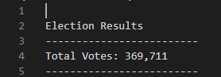
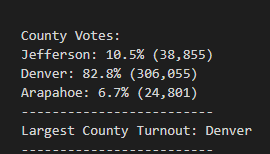
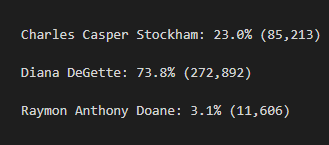
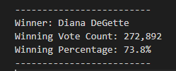

# Election-Analysis

## Project Overview
This project we are helping Tom, a Colorado board of elections employee, in an election audit of a congressional precinct. We were given a CSV file and using python were asked to find specific results for the precinct. The results we need to end with are the total number of votes, number of votes per candidate, percentage of votes each candidate received, and the winner based on the popular vote. This project we created code using loops, if-else statements, reading, and writing text files

## Resources
- Data source: election_results.csv
- Software: Python 3.7.6, Visual studio Code 1.52.1

## Election-Audit Results
Below are the results that we can confirm as the outcomes for this Colorado precinct:

- There was a total of 369,711 votes cast

- The **Largest County Turnout** was **Denver.**
- **Jefferson** had a total of 38,855 votes resulting in 10.5% of the total votes.
- **Denver** had a total of 306,055 votes resulting in 82.8% of the total votes.
- **Arapahoe** had a total of 24,801 votes resulting in 6.7% of total votes.

- **Candidates**
  - **Charles Casper Stockham** received 23.0% of the votes, total: 85,213 votes.
  - **Diana DeGette** received 73.8% of the votes, total: 272,892 votes.
  - **Raymon Anthony Doane** received 3.1% of the votes, total: 11,606 votes.
  

- Winner: **Diana DeGette**
- Winning Vote Count: **272,892**
- Winning Percentage: **73.8%**

## Election-Audit Summary
The script that has been created and run is able to go through the pages of data in the CSV and be able to grab the necessary information to perform the audit very quickly. The script allows you to be able to take any file with the election and the same format with the ballot ID, who they voted for, and the county; and pull the data and can give you the all the information you need within seconds. The script can also be modified if there are different formatting for other elections. One way that it can be adjusted if there are more rows or if the indexes of the rows are different such as the candidate_name= row[2] can be changed based on the index number where  the candidates name appears. Also, you can use it for smaller elections like township elections. When you do not need to see county breakdown and just see the total votes per candidate you can take out the block of coding that requires you to take the counties county when that is not going to be recorded. 
